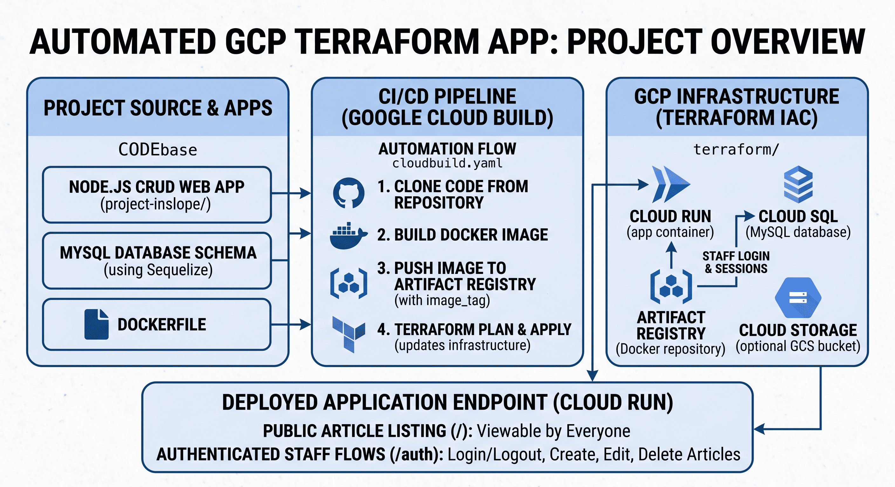

# Automated GCP Terraform App

Node.js **CRUD** web application (articles + staff login) packaged in **Docker**, with **Google Cloud Platform** infrastructure defined in **Terraform** and a **Cloud Build** CI/CD pipeline that builds the image, pushes to **Artifact Registry**, and updates **Cloud Run** using the new image tag.

---

## Table of contents

- [Overview](#overview)
- [Features](#features)
- [Repository layout](#repository-layout)
- [Tech stack](#tech-stack)
- [Architecture](#architecture)
- [Prerequisites](#prerequisites)
- [Run locally](#run-locally)
- [Configuration](#configuration)
- [Infrastructure (Terraform)](#infrastructure-terraform)
- [CI/CD (Cloud Build)](#cicd-cloud-build)
- [Security notes](#security-notes)
- [Troubleshooting](#troubleshooting)
- [Contributing & contact](#contributing--contact)

---

## Overview

This project demonstrates an end-to-end flow:

1. Application code and a `Dockerfile` live under `project-inslope/`.
2. `terraform/` declares GCP resources: **Cloud SQL (MySQL)**, **Artifact Registry**, **Cloud Storage**, and **Cloud Run** (v2).
3. `cloudbuild.yaml` runs on **Google Cloud Build**: clone from your VCS, `docker buildx`, push the image, then `terraform init` / `plan` / `apply` so Cloud Run picks up `image_tag` (by default the commit short SHA).

The values in Terraform and Cloud Build (project IDs, repository names, regions) are **placeholders or example IDs**. Replace them with your own GCP project, Artifact Registry path, and Cloud Source Repository (or GitHub) clone URL before using this in production.

---

## Features

- **Public article listing** at `/` (read-only for visitors).
- **Authenticated staff flows** under `/auth` (login, logout, welcome): create, edit, and delete articles when logged in.
- **Sessions** stored via Sequelize (`connect-session-sequelize`) in MySQL.
- **UI**: EJS templates, Tailwind CSS, Flowbite.

---

## Repository layout

| Path | Purpose |
|------|--------|
| `project-inslope/` | Express app, views, Dockerfile, `package.json`, local `docker-compose.yaml`. |
| `project-inslope/config/db.js` | Sequelize connection settings (must match your MySQL host and credentials). |
| `terraform/` | GCP resources and Cloud Run service definition. |
| `cloudbuild.yaml` | Cloud Build steps: clone, build image, push, Terraform plan/apply. |
| `.gitignore` | Ignores `node_modules`, Terraform plugin dir, local env files, etc. |

---

## Tech stack

| Layer | Technologies |
|--------|----------------|
| Runtime | Node.js 20 (see `Dockerfile`) |
| Web | Express 4, EJS, express-session |
| Data | MySQL 8, Sequelize 6 |
| Styling | Tailwind CSS 3, Flowbite |
| Container | Docker (`node:20-alpine` base image) |
| IaC | Terraform with `hashicorp/google` ~> 5.34 |
| Cloud (intended) | Cloud Run, Cloud SQL, Artifact Registry, Cloud Build, Cloud Storage |

---

## Architecture

High-level diagram (conceptual pipeline and GCP components):



**Flow in short**

- **Source**: Code is hosted in a repository (historically **Cloud Source Repositories**; the sample `cloudbuild.yaml` still clones from there—update the clone URL to match your repo).
- **Build**: Cloud Build builds the Docker image from `project-inslope/` and tags it in Artifact Registry.
- **Deploy**: Terraform applies a new **Cloud Run** revision referencing that image (`image_tag` variable).
- **Data**: **Cloud SQL** for MySQL; optional **GCS** bucket in Terraform for SQL dumps or related files.

---

## Prerequisites

- **Node.js** 20+ (matches the Docker image).
- **npm** (ships with Node).
- **Docker Desktop** (or Docker Engine + Compose v2) if you run the stack with Compose.
- **Terraform** >= 1.0 locally if you test Terraform outside Cloud Build.
- **Google Cloud SDK** (`gcloud`) and a GCP project with billing enabled, if you deploy to GCP.

---

## Run locally

All `npm` commands are run from **`project-inslope/`** (where `package.json` lives).

### 1. Clone

```bash
git clone https://github.com/sssrikar16-lgtm/Automated-GCP-Terraform-App.git
cd Automated-GCP-Terraform-App
```

### 2. Install dependencies

```bash
cd project-inslope
npm install
```

### 3. Database

Choose one:

**A. MySQL only on your machine**

- Install MySQL 8, create a database and user, then edit `config/db.js` with the correct `host` (often `127.0.0.1` or `localhost`), database name, user, and password.

**B. Docker Compose (app + MySQL)**

`docker-compose.yaml` expects an **external** Docker network and volume. Create them once:

```bash
docker network create project-inslope
docker volume create project-inslope-mysql-data
```

Then from `project-inslope/`:

```bash
docker compose up --build
```

The app listens on **port 8080** (`http://localhost:8080`). Compose sets `DB_HOST=mysql` for the app container; align `config/db.js` with the same database name and credentials as in the compose file (and use host `mysql` when running inside Compose).

### 4. Start scripts

| Command | Use |
|---------|-----|
| `npm run start` | Production-style run (`node app.js`). |
| `npm run dev` | Nodemon + Tailwind watch (requires dev workflow setup). |
| `npm run build` | Minified Tailwind output to `./src/build.css`. |

---

## Configuration

### Database (`project-inslope/config/db.js`)

Sequelize is constructed with database name, username, password, and `host`. Defaults in the file are placeholders (`database-name`, `type-a-username`, etc.). These must match:

- Local MySQL, or  
- Docker Compose MySQL service, or  
- **Cloud SQL** (use the instance connection approach recommended by Google—Cloud SQL Auth Proxy or private IP—not raw `0.0.0.0/0` in production).

### Terraform (`terraform/provider.tf`)

Set:

- `project` — your GCP project ID  
- `region` — e.g. `asia-southeast2` to align with `main.tf`

### Terraform resource names (`terraform/main.tf`)

Replace placeholder names with your environment’s values, for example:

- Cloud SQL instance, database, and user names  
- Artifact Registry `repository_id` and image path  
- GCS bucket name (globally unique)  
- Cloud Run service name and image URI  

The sample `cloudbuild.yaml` **image URL** and **`dir:`** paths must stay consistent with the **directory name** Cloud Build checks out (e.g. `final-project-firman` in the sample).

### Session secret (`project-inslope/app.js`)

The session `secret` is hardcoded for demo purposes. For any shared or production deployment, move it to an environment variable or Secret Manager.

---

## Infrastructure (Terraform)

From `terraform/` (after configuring `provider.tf`):

```bash
terraform init
terraform plan
terraform apply
```

Resources defined include (names are illustrative until you customize them):

- `google_sql_database_instance` — MySQL 8  
- `google_sql_database` / `google_sql_user`  
- `google_artifact_registry_repository` — Docker format  
- `google_storage_bucket` — for dumps or related files  
- `google_cloud_run_v2_service` — deploys the container image with `var.image_tag`  
- IAM binding for **unauthenticated** invoke (`allUsers`) — convenient for demos, not typical for production APIs.

**Imports:** If resources already exist in GCP, use `terraform import` (as sketched in `cloudbuild.yaml`) with real project IDs, instance names, and resource addresses. The import block in Cloud Build uses `|| true` so a failed import does not always fail the build; treat that as a template and tighten it for real pipelines.

---

## CI/CD (Cloud Build)

File: **`cloudbuild.yaml`**

Typical stages:

1. **Clone** repository (update URL to your Cloud Source Repos, GitHub mirror, or other supported source).  
2. **Build** Docker image under `…/project-inslope`.  
3. **Push** to Artifact Registry with substitution `_IMAGE_TAG` (defaults to `$SHORT_SHA`).  
4. **Terraform** `init`, optional `import`, `plan`, `apply` with `-var="image_tag=${_IMAGE_TAG}"`.

**Substitutions**

- `_IMAGE_TAG: "$SHORT_SHA"` — ties the running service to the commit that built the image.

**Before first use**

- Point clone URL and `cd` / `dir:` paths at your real repo layout.  
- Replace `prime-hologram-395812`, `docker-repoo-firman`, `docker-images-firman`, and Terraform import paths with your project’s IDs.  
- Uncomment or adjust the `terraform import` step only when IDs are correct; otherwise prefer a clean apply or manual state bootstrap.

---

## Security notes

- Cloud SQL sample allows **`0.0.0.0/0`** in authorized networks—unsafe for production; prefer private IP + connector or Auth Proxy.  
- Cloud Run sample grants **`allUsers`** invoker—public by design for the demo.  
- Session secret and DB passwords should not be committed as real secrets; use env vars and GCP Secret Manager for serious deployments.

---

## Troubleshooting

| Issue | What to check |
|-------|----------------|
| `npm install` at repo root fails | Run commands inside `project-inslope/`. |
| Docker Compose fails on network/volume | Create `project-inslope` network and `project-inslope-mysql-data` volume, or change compose to non-external resources. |
| App cannot reach DB | `host` in `db.js`: `mysql` in Compose, `127.0.0.1` for local Node to host MySQL, Cloud SQL host/IP when on GCP. |
| Terraform auth errors | Run `gcloud auth application-default login` and set correct `project` in `provider.tf`. |
| Cloud Build `dir:` not found | Clone URL + `cd` folder name must match the `dir:` prefixes in each step. |

---

## Contributing & contact

Issues and pull requests are welcome on **[Automated-GCP-Terraform-App](https://github.com/sssrikar16-lgtm/Automated-GCP-Terraform-App)**.

Maintainer: **[@sssrikar16-lgtm](https://github.com/sssrikar16-lgtm)**

---

## License

Application `package.json` specifies **ISC** (see `project-inslope/package.json`). Terraform and config files follow the same repository unless stated otherwise.
